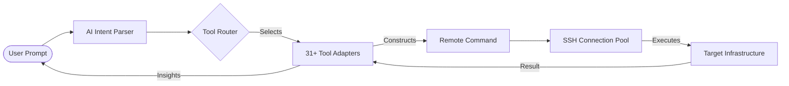
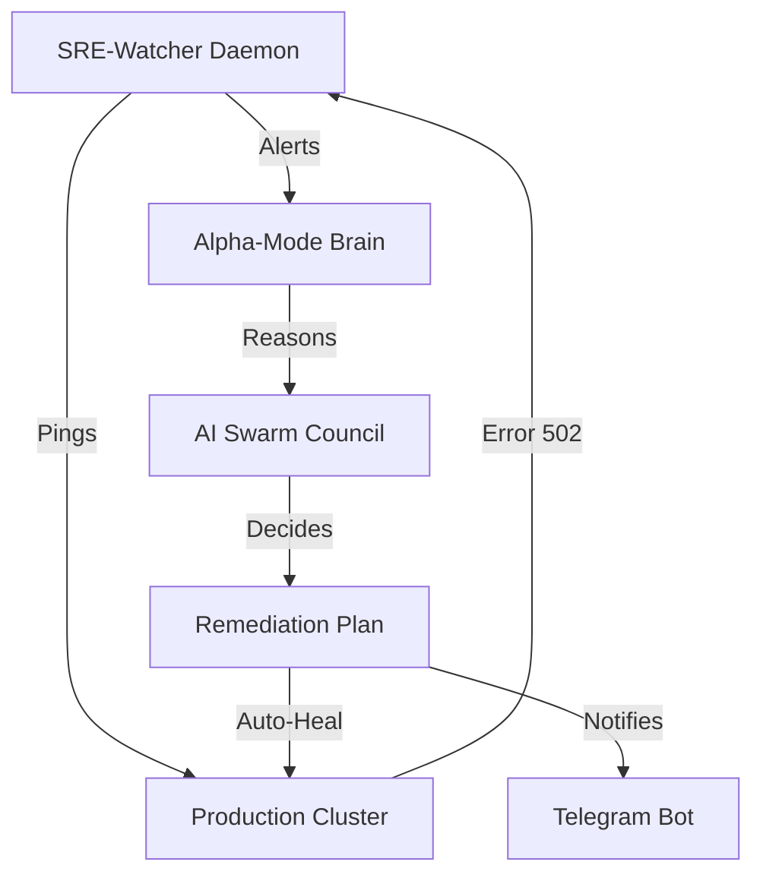
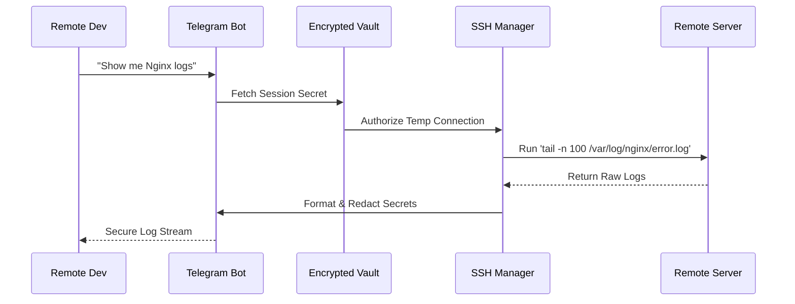

# How InfiniteClaw Orchestrates (Technical Visuals)

Since we are pushing the boundaries of "Alpha-Mode," understanding the internal orchestration is key. Here are the professional technical infographics (via Mermaid) that explain the "How" of this project.

## 1. The Command Chain (Macro-Architecture)
This diagram explains how a natural language prompt becomes a live infrastructure action.

## 2. Alpha-Mode: The Autonomous Healing Loop
How InfiniteClaw moves from a dashboard to an autonomous "SRE-Watcher."

## 3. Secure Bridge: The "Bastion" Flow
How we maintain Zero-Trust principles without exposing root SSH keys to AI agents.

> [!TIP]
> **Pro-Tip**: You can copy these diagrams directly into any Markdown document (like GitHub or Notion) and they will render as professional, high-contrast infographics!

---
*Created by the InfiniteClaw Alpha-Mode Architect.*
