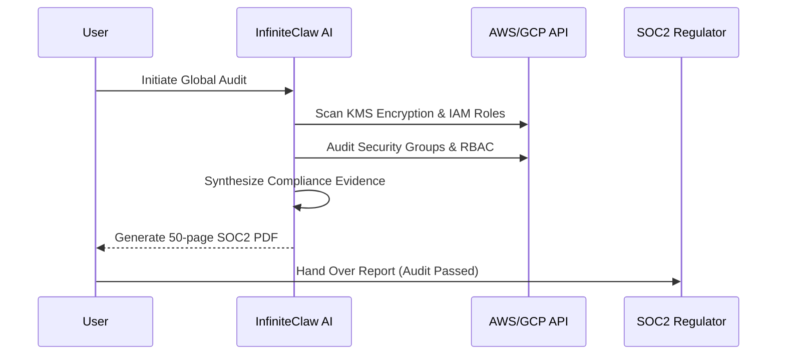
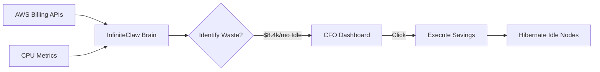
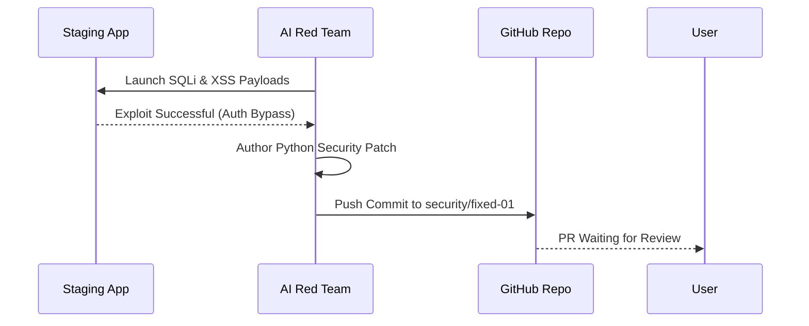
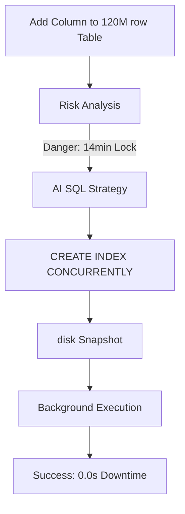

<div align="center">


# ∞ InfiniteClaw

### AI-Powered DevOps Infrastructure Management Platform

**One Claw To Rule Them All. Infinite Reach. Total Control.**

[](https://python.org)
[](https://streamlit.io)
[](https://litellm.ai)
[](https://github.com)

</div>

---

## 📋 Project Description

**InfiniteClaw** is a **local-first, AI-powered DevOps infrastructure management platform** that connects to your remote servers via SSH and provides unified control over 31 enterprise DevOps tools through a single, intelligent dashboard.

It evolves your infrastructure into a **"God-Mode"** environment where a single engineer can manage an entire corporate fleet autonomously.

---

## ∞ Features

| Feature | Description |
|---|---|
| 🧠 **Infinity Core** | A centralized "Jarvis-like" AI hub for one-click infrastructure orchestration |
| ⏪ **Time Travel** | Deterministic state snapshots allow reversing server states to "Yesterday at 4 PM" |
| ⚖️ **AI Swarm Council** | Multi-agent boardroom (SecOps, FinOps, SRE) that debates architecture before deployment |
| 🚀 **Code-to-Cloud** | Zero-config deployments. Drop raw code and the AI authors Dockerfiles/K8s YAMLs |
| 🛠️ **Kill Drift** | Detect manual rogue changes on AWS/GCP and violently overwrite them to match Terraform |
| 🔒 **Auto-SOC2** | Generate 50-page compliance reports autonomously in seconds |
| 💰 **CFO FinOps** | Identify idle cloud resources and assassinate waste with one click |
| 🧨 **AI Red Team** | Autonomous weekly penetration testing with auto-patching git commits |
| 🗄️ **Safe Migrator** | Zero-downtime database schema changes on 100M+ row tables |

---

## 🔄 How It Works (Enterprise Apex)

### 🔒 Autonomous SOC2 Auditing


### 💰 FinOps "CFO Mode" Waste Assassination


### 🧨 AI Red Team Penetration Testing


### 🗄️ Zero-Downtime DB Migration


---

## 🔧 Legacy & VM Support (Inspiration from WolfClaw)

InfiniteClaw honors the legacy of **WolfClaw** by providing robust support for virtualization workflows:
- **Keys**: Native support for **.pem** and **.ppk** (PuTTY) authentication workflows.
- **VirtualBox**: Pre-configured defaults for local VM management (NAT/Host-only adapters).
- **Proxmox/ESXi**: Seamless integration with local hypervisors via SSH.

---

## 🚀 Quick Start (God-Mode Edition)

```bash
# Clone and Setup
python cli.py setup

# Launch the Command Center
python desktop_launcher.py
```

---

## 📄 License

MIT License — Built with ∞ by InfiniteClaw
