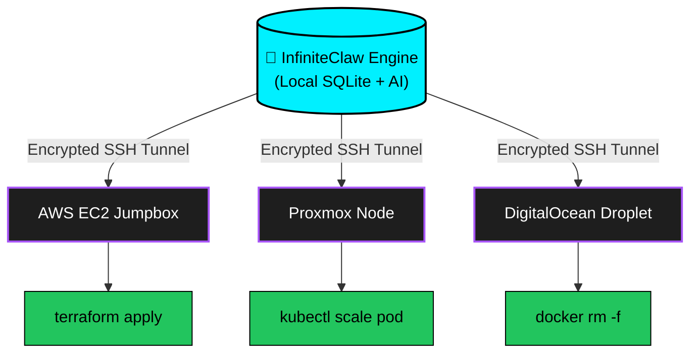
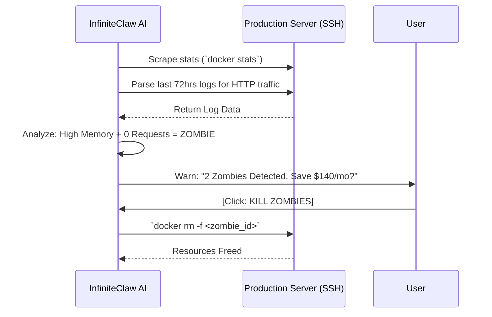
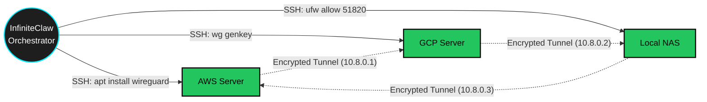
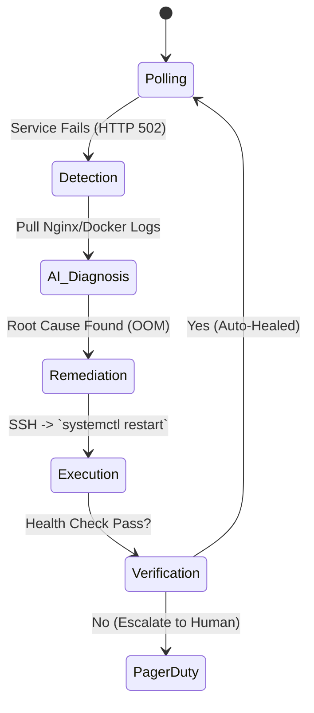

<div align="center">


# ∞ InfiniteClaw
**The DevOps Team Killer.**

[](https://python.org)
[](https://streamlit.io)
[](https://litellm.ai)
[](https://opensource.org/licenses/MIT)

*We are drowning in cloud complexity. InfiniteClaw collapses an entire fragmented DevOps department into a single, autonomous AI agent.*
</div>

---

## 🛑 EXPLICIT INFRASTRUCTURE LIABILITY DISCLAIMER
> [!CAUTION]
> **WARNING**: InfiniteClaw is a highly privileged orchestration tool that executes raw bash commands, modifies server routing, provisions infrastructure, and actively terminates cloud resources.
>
> By running this software, you explicitly acknowledge and agree that:
> 1. **You are granting an AI the ability to execute destructive commands** on the servers you connect to it.
> 2. The authors (Zeta Aztra Technologies / Pravin A Mathew) take **ABSOLUTELY ZERO RESPONSIBILITY** for data loss, server downtime, misconfigurations, deleted Docker containers, compromised SSH keys, network lockouts, or runaway cloud billing costs.
> 3. You run this software entirely at your own risk. Do not connect InfiniteClaw to production infrastructure unless you fully understand the consequences of autonomous execution.

---

## ⚠️ Project Status: Transparency Notice

InfiniteClaw is a highly ambitious, enterprise-level undertaking. While the core SSH execution engine, Auto-Healing, Secrets Scanner, and SRE features are robust and functional, we believe in radical transparency:

> [!IMPORTANT]
> **ROADMAP & CONCEPT MODULES**: Some advanced enterprise features (such as **Terraform Drift Detection**, **Auto-SOC2**, **DB Auto-Migrator**, and **AI Red-Teaming**) are currently in the **Concept Preview** phase. If a module displays a "🚧 [CONCEPT PREVIEW]" banner or a button is unresponsive, it is because we are actively perfecting the AI safety logic before unleashing autonomous destructive commands on your infrastructure.
> 
> **The Code Evolves**: We are developing at light-speed. Evolution is our only constant, and these preview modules are actively being converted into live, SSH-executable nodes.

---

## 🏗️ Architecture: The "Brutal SSH" Paradigm

The modern tech industry wants you to pay thousands of dollars a month for bloated SaaS dashboards and complex APIs. InfiniteClaw rejects that entirely. Instead, it relies on the absolute fundamental building block of the internet: **Brutal SSH**.

Instead of interacting with fragile cloud provider APIs, the AI establishes a literal command-line session on your servers locally via Python's `paramiko`. 



Because it uses raw SSH, you can connect **ANY** server to it. It does not matter if your database is on AWS Fargate or a Raspberry Pi in your closet. InfiniteClaw can automate it identically. 

---

## ⚡ God-Tier Core Capabilities

InfiniteClaw is built to kill the necessity of massive operational teams. It natively supports **31 DevOps Tools** (Docker, Kubernetes, Jenkins, Auth0, Datadog, Prometheus, etc.).

| Feature | The Problem it Solves | InfiniteClaw Solution |
|---|---|---|
| **SRE Auto-Healing** | Waking up at 4 AM to restart a crashed backend router. | Active background daemon reads service logs and autonomously runs `systemctl restart` before you wake up. |
| **Active Cost Assassination** | FinOps tools that generate pretty charts but don't delete waste. | Actively parses Docker HTTP logs via SSH. Identifies idle containers and executes `docker rm -f` lethally. |
| **Time Travel (Rollback)** | A human running `DROP TABLE` or messing up a massive database. | Snapshots the cluster 5 seconds before dangerous commands. Gives you a giant Red Button to rewind time on failure. |
| **Code-to-Cloud** | Writing massive 400-line `Dockerfile` and `K8s.yaml` files. | AI parses your raw source code, authors production-ready Dockerfiles, builds them over SSH, and deploys. |
| **Zero-Trust Mesh** | Connecting AWS to Azure securely without exposing ports. | Select servers. AI installs Wireguard, shares crypto keys, assigns internal IPs, and creates a secure mesh in 30s. |

---

## 🔄 Autonomous Orchestration Workflows 

### 1. The FinOps Assassin (Killing Idle Waste)


### 2. Auto-WireGuard Zero-Trust Mesh


### 3. SRE Auto-Healer (Night Watch)


---

## 🚀 Quick Start (Alpha-Mode Setup)

Launch your own sovereign AI command center locally. 

**Requirements**:
- Python 3.12+
- `OPENAI_API_KEY` (for the AI Brain)
- A server to connect to (IP, User, Password/SSH Key)

```bash
# 1. Clone the repository
git clone https://github.com/pravindev666/InfiniteClaw.git
cd InfiniteClaw

# 2. Setup the encrypted vault and dependencies
python cli.py setup

# 3. Launch the AI Command Center
python desktop_launcher.py
```

---

## 📄 License & Sovereignty

InfiniteClaw is released under the **MIT License**. It is built with the core philosophy that engineers should own their operational data and operational sovereignty. We do not transmit telemetry, we do not require subscription fees, and we do not connect to external hyperscalers unless you explicitly command the AI to do so.

*Mastered by Pravin A Mathew / Zeta Aztra Technologies.*
